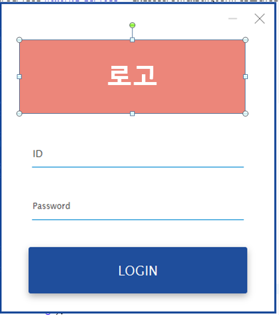
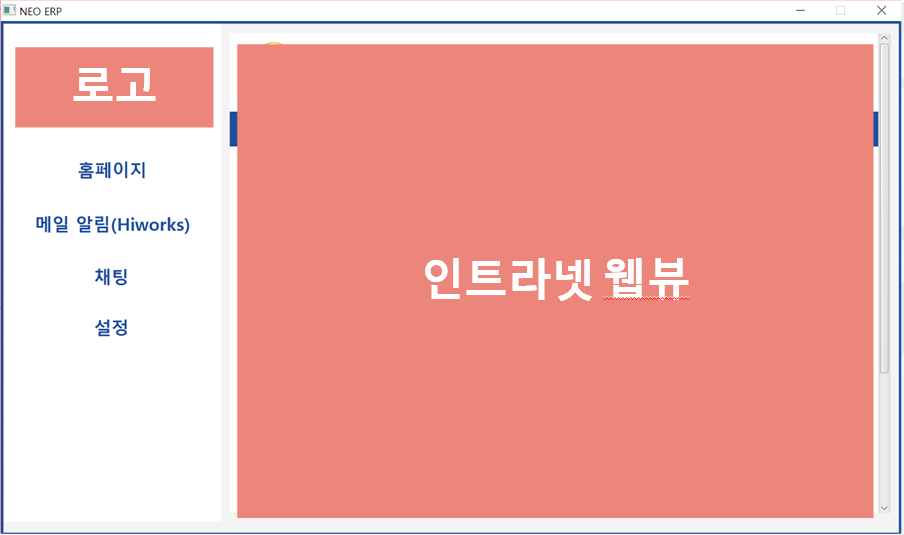
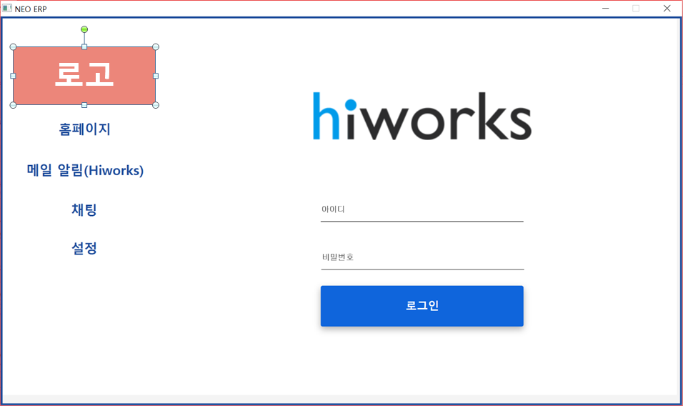
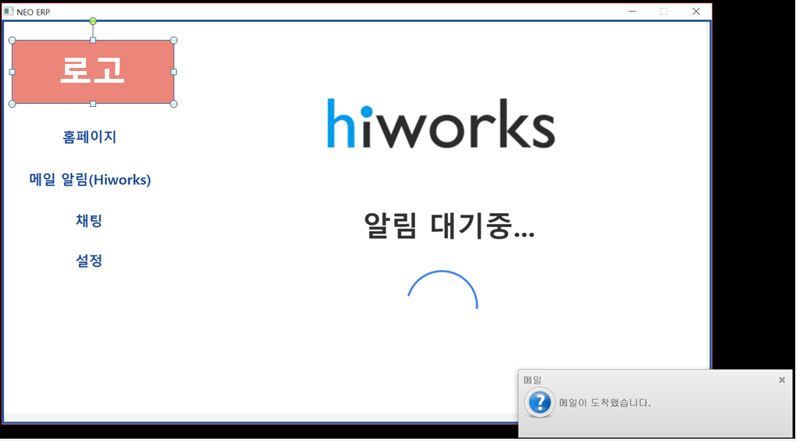
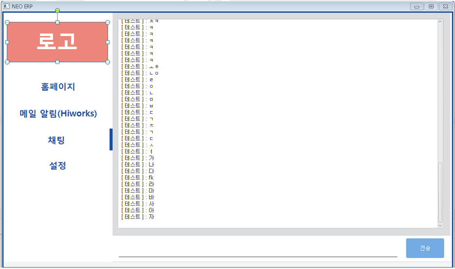
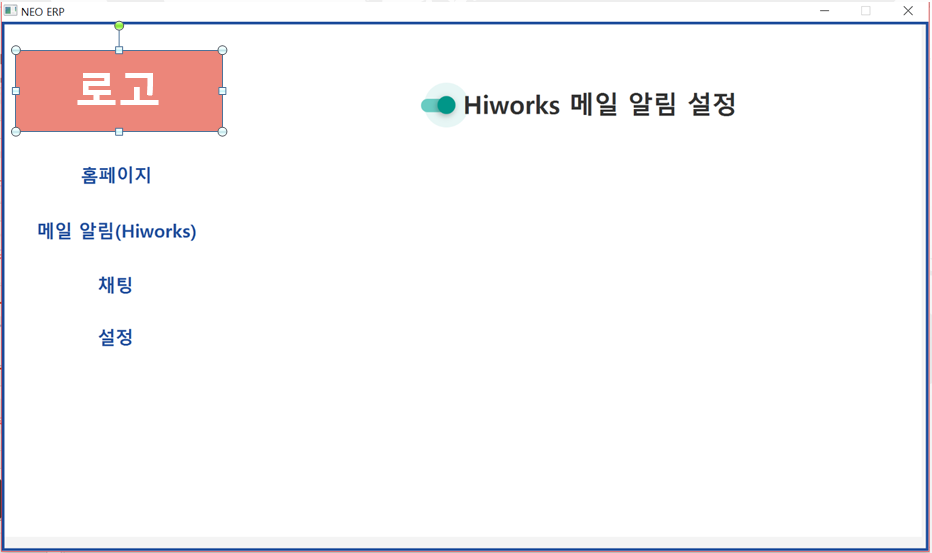

# 개요 (Overview)

- 해당 프로젝트는 메일 알림 시스템 pc버전으로 회사인트라넷, hiworks 웹메일을 합쳐 구현하였습니다.

- 인트라넷의 경우 문제가 될것 같아 숨김처리 했습니다.

- 메일 알림의 경우 hiworks를 직접 크롤링하여 가져와 발생시킨것입니다.

- 사용기술 : javafx, mysql

# 주요기능

- 로그인 : 회사 사람들만 이용가능

- 인트라넷 웹뷰 : 웹뷰를 통해 인트라넷 이용가능

- 메일알림기능 : hiworks 아이디로 로그인하여 실시간으로 메일알림을 받아볼수 있음

- 채팅 : 회사사람들과 소통가능

- 설정 : 메일 알림을 켜고 끌수 있음

# 화면

    

    

    

    

    

    

